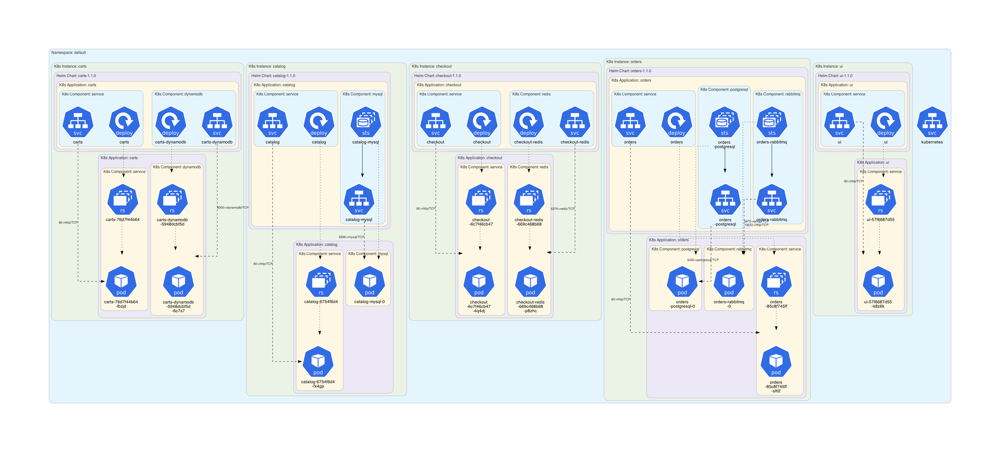
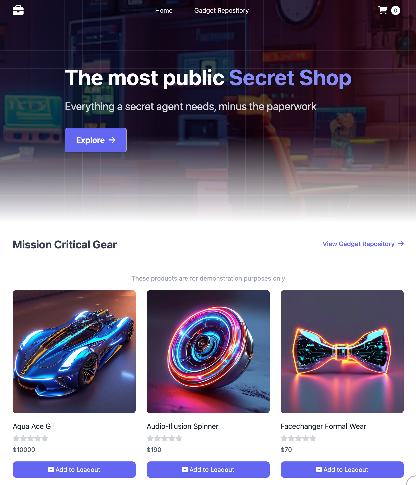
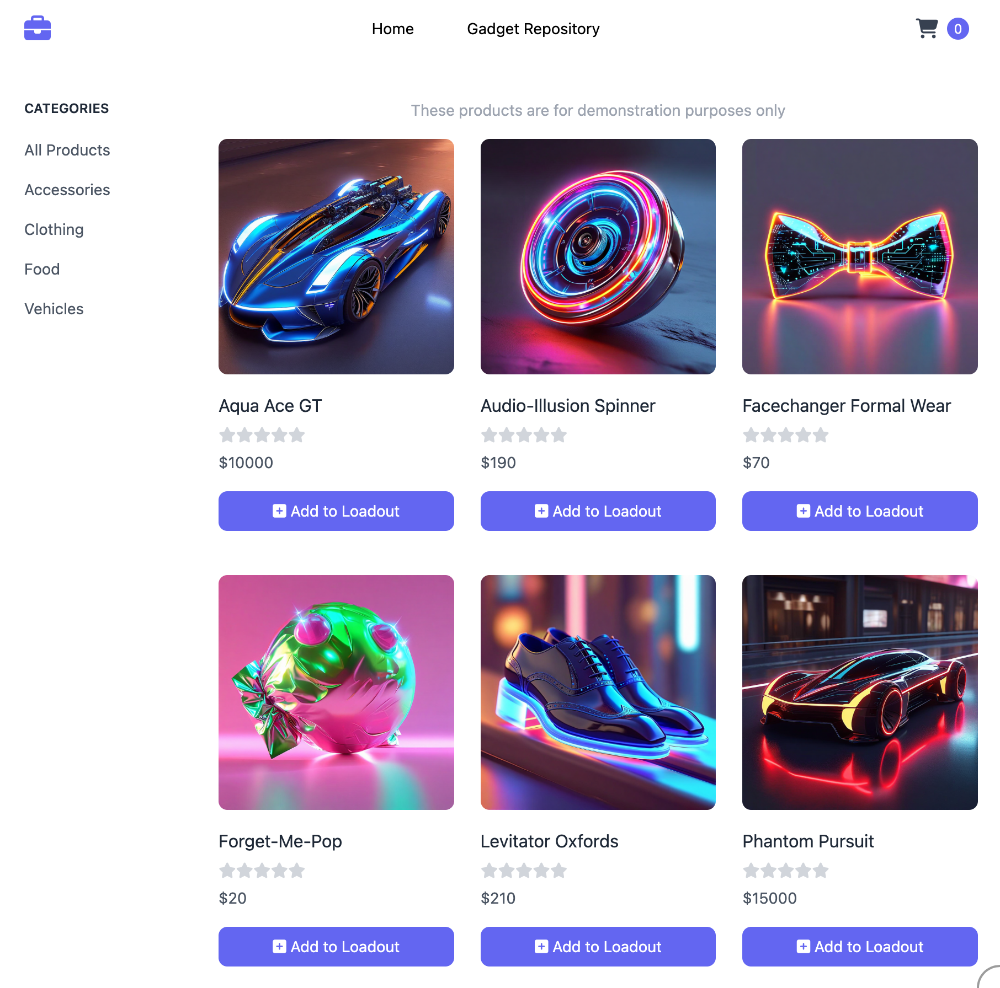

# Capstone Project

## Getting started

Clone the repository.

```sh
git clone 
```

Pull all changes from the remote repository. Do this before you push your code changes.

```sh
git pull --rebase
```

## Deployment

Deploy the online retail store.

```sh
kubectl apply -f https://github.com/aws-containers/retail-store-sample-app/releases/latest/download/kubernetes.yaml
kubectl wait --for=condition=available deployments --all
```

Get the URL for the online retail store.

```sh
kubectl get service ui
```

Teardown the online retail store.

```sh
kubectl delete -f https://github.com/aws-containers/retail-store-sample-app/releases/latest/download/kubernetes.yaml
```

## Architecture




This diagram was generated with [KubeDiagrams](https://github.com/philippemerle/KubeDiagrams).

## Online Retail Store

| homepage | catalog |
|--|--|
|  |  |
